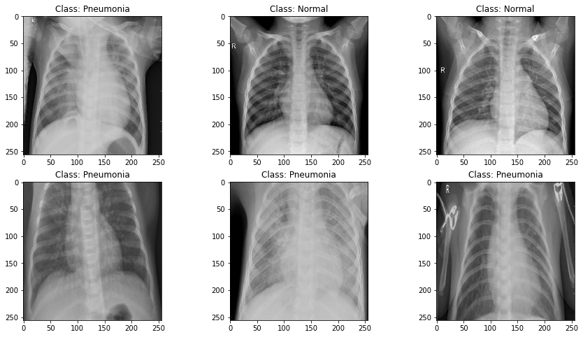

# Pneumonia Image Classification

## Buisness Understanding 
Biomedical Imaging is important for clinical diagnostics to classifify conditions a patient might have. In order to make these decisions domain knowldege is needed. The saying that a picture can describe a thousand words is true when doctors make there assessments but, it is limted only by the doctors perception of the biomedical images to classify conditions based on biomedical imaging. Creating deep learning models that can classify conditions can be useful in clinical practice to remove such high dependencies on a doctors domain knowledge. Not all medical conditions are easy to classify based on medical imaging. Creating deep learning models that can classify conditions is crucial because deep learning models can learn what we humans can not visually see in biomedical imaging. Implementing such models in biomedical devices in the future can change the landscape of point of care diagnostics and clinical diagnostics.

## Data Understanding 
The X-ray images images used in this git repo are of pediatric patients. The classification is a binary case on whether a pateint has pneumonia. The dataset comes from Kermany et al. on [Mendley](https://data.mendeley.com/datasets/rscbjbr9sj/3). The training data consists of about 4000 images classified as Pneumonia and about 1500 images of Normal images (No Pneumonia). The testing data consists of about 400 Pneumonia images and about 250 Normal images.

Deep Learning uses information found in data which in this case are images. It is a type of machine learning that involves training artifical neural networks to perform tasks. In this notebokk the task is to classify an image/condition as 'Normal' or 'Pneumonia'. The deep network learns to recognize patterns and features by adjusting its paramters based on the input data. 

The dataset does have an imbalance of data images. This as a result may cause higher Precision favoring since there is more pneumoina images to train on. We can use data augmentation to address this issue to create 'synthetic' images for the model to train on. 

## Data Preparation 

## Modeling 

## Evaluation