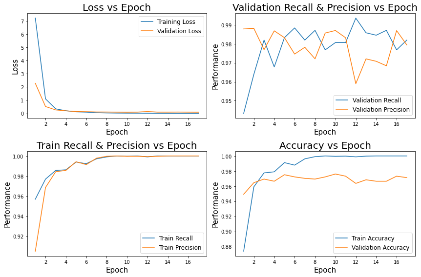
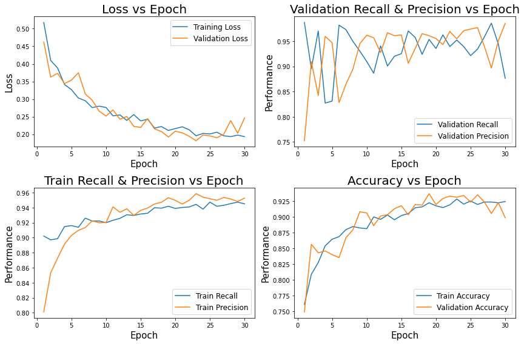
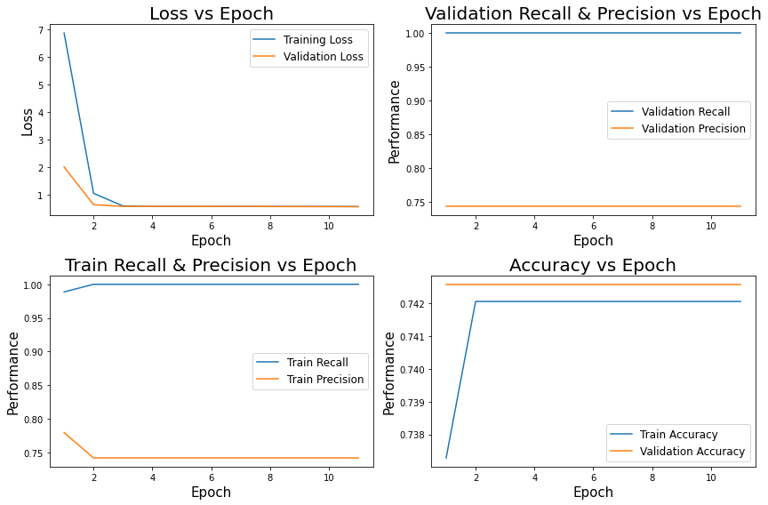
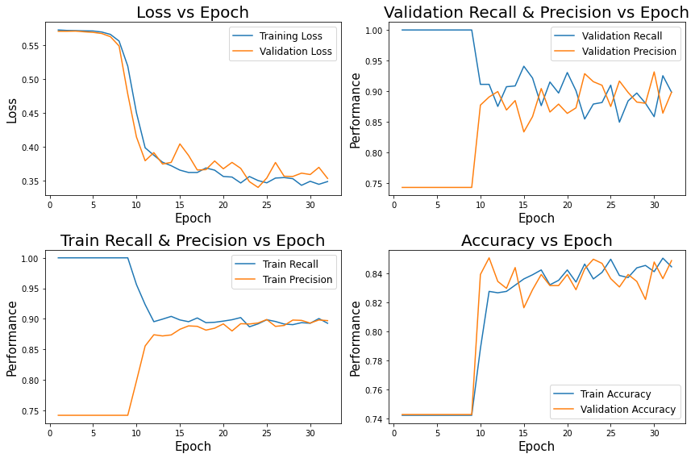

# Pneumonia Image Classification

## Buisness Understanding 
Biomedical Imaging is important for clinical diagnostics to classify conditions a patient might have. In order to make these decisions domain knowldege is needed. The saying that a picture can describe a thousand words is true when doctors make there assessments but, it is limted only by the doctors perception of the biomedical images to classify conditions based on biomedical imaging. Creating deep learning models that can classify conditions can be useful in clinical practice to remove such high dependencies on a doctors domain knowledge. We have to acceptnNot all medical conditions are easy to classify based on medical imaging. Interpretation of an image is only limited to what someone knows and sees. Creating deep learning models that can classify conditions is crucial because deep learning models can learn what we humans can not visually see in biomedical imaging. Implementing such models in biomedical devices in the future can change the landscape of point of care diagnostics and clinical diagnostics.

### Stakeholder
Image Classification is a powerful tool because we can implement models for biomedical purposes into biomedical diagnostic devices. These devices depending on the purpose can be point of care or meant for a clinical setting. [Tempus](https://imagen.ai/technology/) is a company that focuses on implenting machine learning methods into medical devices by analyzing clinical, genomic, and molecular data. [Tempus Radiology](https://www.tempus.com/radiology/) is the specific department of interest for this project. Tempus does currently has an AI solution called 'Pixel for Radiology' which is a tool radiologist can use for diagnoising lung related diseases and conduitions by analyzing lung nodules. The software was approved by the FDA as a screentool as a Computer Aided System that can provide diagnostic information but the software was designed to specifically monitor lung cancer as discuessed in there [journal article](https://link.springer.com/article/10.1007/s11604-020-01009-0). With that being said, Tempus Radiology wants to look into more than cancer related deep learning tasks using CT-scans in the future. They have the foundation but would like to expand on the applications of there Pixel-Lung AI software to now classify and view developing conditions just like there current framework but with other Lung diseases and conditions.

## Data Understanding 
The X-ray images images used in this git repo are of pediatric patients. The classification is a binary case on whether a pateint has Pneumonia. The dataset comes from Kermany et al. on [Mendley](https://data.mendeley.com/datasets/rscbjbr9sj/3). The dataset on Kaggle is from the original source using Version 2 that was published on January 01, 2018. This dataset has gone through the trouble of image cleaning which is just getting rid of bad quality images. The training data consists of about 4000 images classified as Pneumonia and about 1500 images of Normal images (No Pneumonia). The testing data consists of about 400 Pneumonia images and about 250 Normal images. Unfortunatly the nature of this dataset originally contains 16 validation images. This is a small amount of images to truly monitor the validation loss. Instead a custom validation folder was made by incorportaing the 16 images in the val folder back into the train folder and randomly selecting 20% of the train set of each category. In this repository the custom data distribution was utilized.

### Original Data Distrubution

### Custom Data Distribution

Deep Learning uses information found in data which in this case are images. It is a type of machine learning that involves training artifical neural networks to perform tasks. In this notebook the task is to classify an image/condition as 'Normal' or 'Pneumonia'. The deep network learns to recognize patterns and features by adjusting its paramters based on the input data which are tensors that are derievd from images. 

The dataset does have an imbalance of images. This as a result may cause higher Recall/Sensitivity beacuse there are more pneumonia images to train on. This is the case because Pneumonia is our True positive case which as a result increaseing the the True Positive Rate which is Recall. We can use data augmentation to address this issue to create 'synthetic' images for the model to train on to have more availability to Negative cases which are normal images. Adding on, we can also attempt transder learning using the VGG19 pretrained model network to see what result we get on our test and training sets.

## Data Preparation
Deep Learning requires images to be the same size as well as normalized. In this dataset, images should be resized to a consistent dimension, and pixel values should be normalized. All the data preapation can be found in the functions python file in a function called 'process_data'. Overall this function resizes all images to a common dimension which in this case was 128, 128. Normalization was conducted by normalizing pixel values to a common scale which was done by dividing each pixel value in the image by 255 which as a result brings all pixel values to a value between 0 and 1. The function will also convert the grayscale images that have 1 channel to become a 3 channel image which is supported by many transfer learning models. Three channel images are just 'RGB'. An Image Data Generator was utilized to faciliate this process that labels Pneumonia as the postive instance and Normal images as the negative case. 

## Model Summaries

|      Model      | Train Precision/Specificity | Validation Precision/Specificity | Test Precision/Specificity | Train Recall/Sensitivity | Validation Recall/Sensitivity | Test Recall/Sensitivity | Training Time (HH:MM:SS) |
|:---------------:|:---------------------------:|:--------------------------------:|:--------------------------:|:------------------------:|:-----------------------------:|:-----------------------:|:------------------------:|
|     MLP Base    |            96.98%           |              95.56%              |           73.09%           |          97.23%          |             97.16%            |          98.20%         |                  |
|  MLP Version 7  |            99.25%           |              96.42%              |           73.75%           |          98.26%          |             97.29%            |          98.71%         |         00:16:56         |
|  MLP Augmented  |            84.61%           |              83.77%              |           67.52%           |          91.34%          |             89.81%            |          94.35%         |         00:21:19         |
|     CNN Base    |            99.42%           |              96.36%              |           70.72%           |          99.32%          |             98.96%            |          99.74%         |         00:10:44         |
|  CNN Version 3  |           100.00%           |              98.56%              |           71.85%           |          100.00%         |             97.68%            |          99.48%         |         00:10:44         |
|  CNN Augmented  |            98.64%           |              98.85%              |           88.43%           |          88.79%          |             89.04%            |          94.10%         |         00:23:11         |
|      VGG19      |            74.20%           |              74.25%              |           62.50%           |          100.00%         |            100.00%            |         100.00%         |         00:50:24         |
| VGG19 Augmented |            90.54%           |              89.49%              |           78.24%           |          88.47%          |             88.91%            |          71.02%         |         02:28:32         |

## Performance Metrics
### Machine Learning Perceptrons 
#### Version 7 Plots
The Machine Learning Perceptrons (MLP) alone did not do very well in learning how an image can be a negative case. Yes the dataset was imbalanced which as a result caused the Recall to be substantially better in the test set. The Version 7 model is really good at classifying positive cases as shown in the Recall performance metric of 98.71%. The model fails to learn how to classify a negative case. This leads to a poor Precision Metric. The model never does over fit and on paper the model converges on both the validation and training sets having minimal losses. This overall shows how the model has learned everything it can learn using only MLP. This behavior is shown in the Loss vs Epoch graph below.

|     Set    |  Loss | Precision | Recall | Accuracy |
|:----------:|:-----:|:---------:|:------:|:--------:|
|    Train   | 0.074 |   99.25%  | 98.26% |  98.16%  |
|    Test    | 0.865 |   73.75%  | 98.71% |  77.24%  |
| Validation | 0.149 |   96.42%  | 97.29% |  95.31%  |

#### Augmented Plots
Another approach was to take the trained Version 7 MLP model and attempt data augmentation in hopes of improving the Precision. Using augmented data generators would act as new images for the model to train on. The validation and training sets were augmented images while the test set was not augmented. Overall we achieved a worse Precision performance and Recall Performance. There was no success in data augmentation. 

**The test set is not augmented data. They are the regular images**

|     Set    | Losss | Precision | Recall | Accuracy |
|:----------:|:-----:|:---------:|:------:|:--------:|
|    Train   | 0.434 |   84.61%  | 91.34% |  81.25%  |
|    Test    | 0.580 |   67.52%  | 94.35% |  68.10%  |
| Validation | 0.431 |   83.77%  | 89.81% |  79.52%  |

### Convolutional Neural Network with Machine Learning Perceptrons 
#### Version 3 Plots
Including a convolutional layer in the model architecture proved to almost perfectly classify positive images which include Pneumonia. All sets were around 99%. The lack of Normal images to train on caused the model to perform poorly on the Normal images in the test set. Even though the model converges on both the validation and train with no over fit as seen the graph below the test set does not do well on the negative cases as shown by the low test Precision Score. The model does very well classifying Pneumonia images on sets.

|     Set    |  Loss | Precision |  Recall | Accuracy |
|:----------:|:-----:|:---------:|:-------:|:--------:|
|    Train   | 0.020 |  100.00%  | 100.00% |  100.00% |
|    Test    | 1.336 |   71.85%  |  99.84% |  75.32%  |
| Validation | 0.097 |   98.56%  |  97.68% |  97.22%  |

#### Augmented Plots
Since Convolutional layers take advantage of spatial feature hierarchies I expected a big performance increase in Precision and slightly smaller performance decrease in Recall. When it comes to images spatial hierarchies and patterns are important for the model to learn and understand. Using Data Augmentation I took the trained Convolutional Neural Network version 3 and retrained it with augmented data. As a result, the model did great on Normal images! Looking at the loss curves the model does not show signs of over fit as both curves are still generally decreasing. The model learns well and performs great!

**The test set is not augmented data. They are the regular images**

|     Set    |  Loss | Precision | Recall | Accuracy |
|:----------:|:-----:|:---------:|:------:|:--------:|
|    Train   | 0.228 |   98.64%  | 88.79% |  90.78%  |
|    Test    | 0.360 |   88.43%  | 94.10% |  88.62%  |
| Validation | 0.217 |   98.85%  | 89.04% |  91.10%  |

### VGG19 Transfer Learning
#### Version 1 Plots
Transfer Learning can be very useful and usually very effective. The main downside of deep transfer learning is training time. It can take substantially longer to train the dense network that is added on due the higher parameter count even though we set the vgg19 model to not train. Using VGG19 with a custom dense network just yielded 

#### Augmented Plots

**The test set is not augmented data. They are the regular images**

## Evaluation